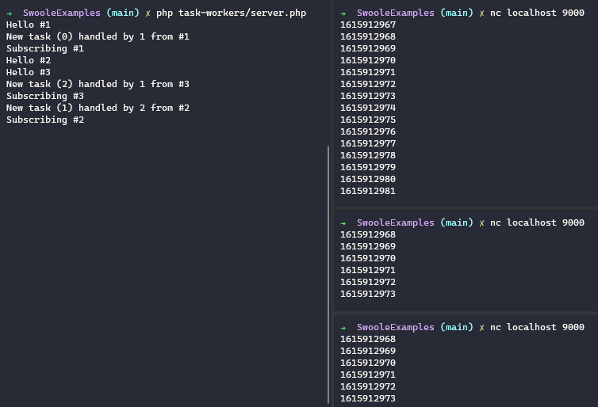

# Task Workers

This example is mounted as is to illustrate the problem presented on this [thread at Swoole's Slack Channel](https://swoole.slack.com/archives/CHSHMCR97/p1615881097001800).

**Mainly the objetive is to actively forward messages from separate processes to persisted-connected clients.**

It starts a `Server` with 1 `Worker` and 2 `Task Workers`:
- `Worker` just forwards messages like `subscribe` and `unsubscribe` to the `Task Workers` when a Client connects or disconnects.
- `Task Workers` then simulates a long-running process (`while (true)`) that just sends to its subscribers the current `time()`.

> ⚠️ This is just to prove a concept (PoC) and doesn't serves as an example for the best code design or architectural decisions
